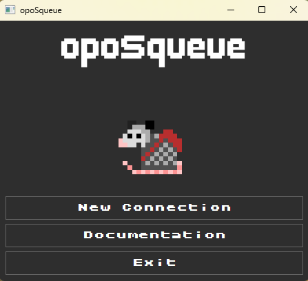
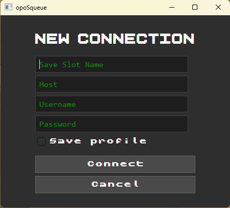
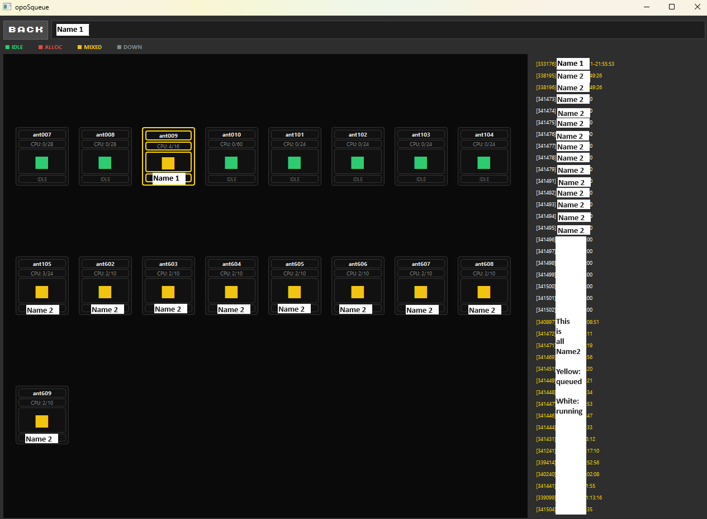
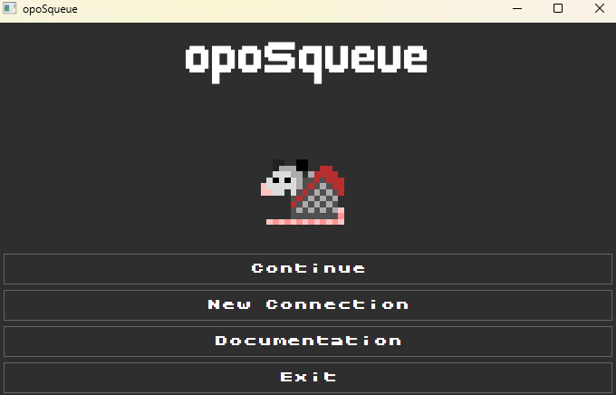
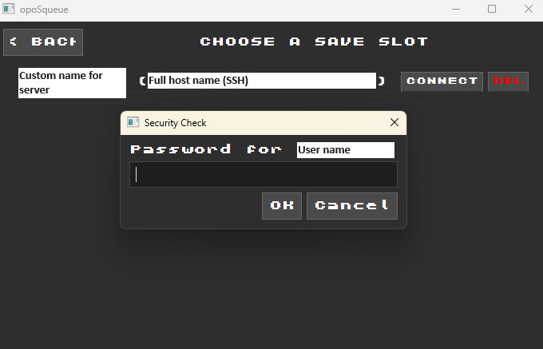

# OpoSqueue v0.1.1


## Introduction
OpoSqueue (or OpoSQ for short), is a Python-based CLI tool that allows the user to connect to a remote server (through SSH) and monitor the HPC jobs that are currently queued and running. If you are tired of typing "squeue" every other minute to check the status of your analysis, just run OpoSqueue through your Command Line and enjoy a window that will update every 5 seconds with the nodes status!

This tool is expected to get soon other updates, mostly regarding its appearance, but if you have any suggestions about additional functionalities that could be useful for your every-day work, feel free to contact me.

## Table of Contents
- [0. Set-Up](#0-set-up)
- [1. How to run](#1-how-to-run)
- [2. Components](#2-components)
- [3. Contributing and support](#3-contributing-and-support)
- [4. Possible problems](#4-possible-problems)
- [5. Contacts](#5-contacts)

## 0. Set-Up
GUI support is required on the user system, so it is recommended to install opoSqueue on your local computer, not on the cluster login node. Your computer will also need Python >=3.11, so make sure to have the correct version (run `python --version`) or [download it](https://www.python.org/downloads/). 

Once you have the correct version of Python, install this package by simply cloning the repository running this command through the Terminal:

```bash
pip install git+https://github.com/flavialeotta/opoSqueue.git
```

The installation will automatically take care of the dependencies, but it is also possible to manually install them by cloning the repository and then running the command:

```bash
pip install -r requirements.txt
```

## 1. How to run
To run opoSqueue simply type:

```bash
oposqueue
```

and you're good to go! It will open the following window:



### Save your connection details
To start a new connection, click on "New Connection. This button will redirect you to the following window:



and you can fill in the required fields:

- *'Save Slot Name'*: an optional field that lets you rename a connection to a name easy to remember, like "University" or "Work";
- *'Host'*: the SSH address;
- *'Username'*: the user name at which you're registered in the server;
- *'Password'*: the server's account Password. **Important: opoSqueue NEVER stores your passwords!**.

### Main window
Once the connection is established you will be redirected to the cluster view of your HPC nodes.



This window not only shows an overview of all the nodes available in the HPC cluster and their statuses, but also a list of queued jobs (on the right). Each node also displays the number of CPUs available and allocated, as well as the name of the user currently running analyses on that node and a color-coded 'window' depending on its status:

- green: available and free;
- yellow: partially occupied;
- red: completely allocated;
- grey: down (lost connection to the node).

The status of each node is updated every 5 seconds. An interesting feature of opoSqueue is the possibility of searching for a specific Username (on the top bar) which will promptly highlight any node currently used by that same user. This gives a quick access on the status of your analyses: once no node is highlighted, all your analyses will have finished!

### What’s new?
- **v0.1.1** (02/06/2026): Added information on allocated memory for each job and memory usage percentage information in the cluster view window. It is only displayed for running jobs.

### Access saved connections

If you have ticked "Save connection" when providing connection's data, the next time you will open opoSqueue, a new button will appear: continue.



Once you click on that button, you will be redirected to a list of all the connections previously saved. To connect again, select "Connect" and provide your password in the pop-up window:



## 2. Components
Folder structure:

```text
opoSqueue
│   .gitignore
│   pyproject.toml
│   README.md
│   requirements.txt
│
└───src
    └───oposqueue
        │   main.py
        │   __init__.py
        │   __main__.py
        │
        ├───core
        │       asset_path.py
        │       polling_service.py
        │       profile_manager.py
        │       slurm_parser.py
        │       ssh_manager.py
        │       state_store.py
        │       __init__.py
        │
        ├───models
        │       job.py
        │       node.py
        │       ssh_profile.py
        │       __init__.py
        │
        ├───storage
        │   ├───profiles
        │   │       .gitkeep
        │   │
        │   └───static
        │           png files for documentation
        │
        └───ui
            │   logo.png
            │   __init__.py
            │
            ├───fonts
            │       custom fonts ttf files
            │
            ├───piskels
            │       raw files for sprites
            │
            ├───sprites
            │       gif files for sprites
            │
            ├───widgets
            │       fonts.py
            │       job_queue_panel.py
            │       node_tile.py
            │       save_slot_widget.py
            │       __init__.py
            │
            └───windows
                    cluster_view.py
                    connection_dialogue.py
                    save_select_screen.py
                    title_screen.py
                    __init__.py
```

Components of opoSqueue:

1. **`core`**
   - Contains the backend logic for SSH connection handling, Slurm queue parsing, profile storage, and the periodic polling service.
   - Key files: `ssh_manager.py`, `slurm_parser.py`, `polling_service.py`, `profile_manager.py`, `state_store.py`, `asset_path.py`.

2. **`models`**
   - Defines the data structures that represent jobs, nodes, and stored SSH profiles.
   - Key files: `job.py`, `node.py`, `ssh_profile.py`.

3. **`ui/widgets`**
   - Contains reusable UI components such as the node tiles, job queue panel, save-slot widget, and custom fonts.
   - These widgets are used inside the main application screens.

4. **`ui/windows`**
   - Contains the application window screens: cluster view, connection dialogue, save slot selection, and the title screen.
   - These files define how each screen is assembled and how user actions are handled.

5. **`storage`**
   - Stores app assets and saved connection profiles.
   - `static` holds images used in the README and the GUI, while `profiles` stores saved SSH connection slots.

## 3. Contributing and support

If you find a bug, want to request a feature, or would like to contribute, here is the best way to help:

- **Bug reports**
  - Describe the exact steps to reproduce the issue.
  - Include the operating system and Python version.
  - Attach any error messages, stack traces, or screenshots.

- **Feature requests**
  - Explain the desired behavior and why it would be useful.
  - Give an example of how you would use the feature.

- **Contributions**
  - Feel free to open a pull request on GitHub with a fix or enhancement.
  - Keep changes small and focused.
  - Add comments in the code and update the README if you change behavior.

- **Opening a GitHub issue**
  - Go to the repository page on GitHub: `https://github.com/flavialeotta/opoSqueue`
  - Click the `Issues` tab.
  - Click `New issue`.
  - Choose the appropriate template or enter a short title.
  - Describe the problem or request, include steps to reproduce, and attach any error output or screenshots.

If you do not want to use GitHub issues, you can contact me directly by email (see below).

## 4. Possible problems
### WARNING: The script oposqueue.exe is installed in '...' which is not on PATH.
This is usually a local configuration problem, which can be easily solved. Locate the path that is provided by the warning message (usually something along the line of 'C:\Users\name of the user\intermediate folders\Python\pythoncore-version\Scripts')

Run this PowerShell command:

```PowerShell
[Environment]::SetEnvironmentVariable("Path", $env:Path + "; path given by the error message", "User")
```

Do not change "User" for your user name. Then, restart your Terminal window.

### -bash: pip: command not found
When trying to install opoSqueue, if the computer doesn't have Python's package manager (pip) installed, the action will fail. You can try to download pip itself, or bypass it by running the following command:

```bash
python3 -m pip install git+https://github.com/flavialeotta/opoSqueue.git --user
```
If this will also fail, it might be due to a version of Python that is too old (<3.11) so please check your Python version and update if needed.

If you are located on a server, though, and have admin restrictions that prevent you from updating Python, I warmly suggest you to use opoSqueue on your personal computer and remotely connect to the server through the app itself.

### ImportError: libEGL.so.1: cannot open shared object file: No such file or directory

This error occurs when you try to run opoSqueue on a server or remote machine without a graphical desktop environment. OpoSqueue requires a desktop environment (X11, Wayland, or equivalent) to render its graphical interface, and remote cluster login nodes and headless servers do not have these graphics libraries installed.

It is vividly recommended to install and run opoSqueue on your local computer (Windows, macOS, or Linux desktop), then use opoSqueue itself to connect to and monitor the remote cluster.

If you must run on a remote server, on the internet there are guides on how to set up a desktop-enabled remote session using X11 forwarding (`ssh -X user@server`), VNC (Virtual Network Computing) or graphical remote desktop application (RDP, TeamViewer, etc.). I have not tried these solutions yet so I cannot personally recommend this approach.

## 5. Contacts
For any type of inquiries, bug reports, or feature requests, you can contact me at:

- Personal: `flavia.leotta@hotmail.com`
- Institutional: `fleotta@cent.uw.edu.pl`
